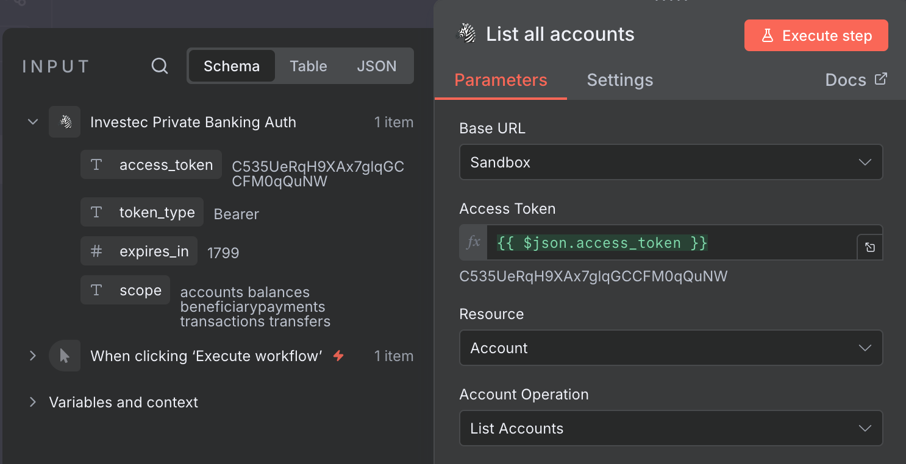

# n8n-investec-private banking

This is an n8n community node. It lets you interact with your Investec Private banking account via their [Programmable Banking API](https://developer.investec.com/za/api-products/documentation/SA_PB_Account_Information)

To learn more about Investec Programmable banking visit https://developer.investec.com/za/home

[n8n](https://n8n.io/) is a [fair-code licensed](https://docs.n8n.io/reference/license/) workflow automation platform.

[Installation](#installation)  
[Operations](#operations)
[Credentials](#credentials)
[Compatibility](#compatibility)
[Usage](#usage)
[Resources](#resources)
[Version history](#version-history)
[Development](#development)
[Running Locally](#running-locally)
[Contributing](#contributing)
[License](#license)

## Installation

Follow the [installation guide](https://docs.n8n.io/integrations/community-nodes/installation/) in the n8n community nodes documentation.

## Operations

### Auth Actions
1. Get access token

### Accounts Actions
1. List all accounts
2. Get account balance
3. Get account transactions
4. Get account pending transactions

### Profile Actions
1. List all profiles consented to
2. List all profile accounts
3. List authorisation setup details
4. List all available beneficiaries

### Transfer Actions
1. Inter account transfers

### Document Actions
1. List all documents
2. Retreive document

### Beneficiary Actions
1. List of beneficiaries
2. List of beneficiary categories
3. Pay multiple beneficiaries

## Credentials

The API uses OAuth2 for authentication and all operations require Bearer token authentication. To assist with this there is a Investec Private Banking Auth node.

To use the node, add it to your workflow and setup a new credential.


Enter your Client ID, Client Secret and API key obtained from the Investec Portal


**NOTE**: Nodes do not refresh an expired token. You will need to do this manually in your workflows

## Compatibility

Developed and tested using n8n version 1.111.0

## Usage


Basic requirements for using the nodes is that you need to first get an access token using the Auth node. After that the token can be passed to the other nodes to execute different [operations](#operations) 



## Resources

* [n8n community nodes documentation](https://docs.n8n.io/integrations/#community-nodes)
* [Programmable Banking API](https://developer.investec.com/za/api-products/documentation/SA_PB_Account_Information)

## Version history

v.1.0.0: First release includes all the operations avaialable on the API

## Development 

You need the following installed on your development machine:

* [git](https://git-scm.com/downloads)
* Node.js and npm. Minimum version Node 20. You can find instructions on how to install both using nvm (Node Version Manager) for Linux, Mac, and WSL [here](https://github.com/nvm-sh/nvm). For Windows users, refer to Microsoft's guide to [Install NodeJS on Windows](https://docs.microsoft.com/en-us/windows/dev-environment/javascript/nodejs-on-windows).
* Install n8n with:
  ```
  npm install n8n -g
  ```
* Recommended: follow n8n's guide to [set up your development environment](https://docs.n8n.io/integrations/creating-nodes/build/node-development-environment/).

## Running locally

First install all the requirement for local development.

To build run
```bash
npm run build
npm link
```

Then to test locally
```bash
cd ~/.n8n/custom
npm link n8n-nodes-investec-private-banking
n8n start
```

## Contributing
- 🐛 **Report Bugs**: Open an issue with detailed bug reports
- 💡 **Feature Requests**: Suggest new features or improvements
- 📝 **Documentation**: Help improve our docs and code comments
- 🔧 **Code Contributions**: Submit pull requests for bug fixes or features

## TODO
- Templates for contributing
- To make your custom node available to the community, you must create it as an npm package, and [submit it to the npm registry](https://docs.npmjs.com/packages-and-modules/contributing-packages-to-the-registry).
- If you would like your node to be available on n8n cloud you can also [submit your node for verification](https://docs.n8n.io/integrations/creating-nodes/deploy/submit-community-nodes/).

## License

[MIT](https://github.com/n8n-io/n8n-nodes-starter/blob/master/LICENSE.md)

## 🌟 Star History

[](https://star-history.com/#yourusername/n8n-investec-private-banking&Date)

---

<div align="center">
  <p>If you find this project helpful, please give it a ⭐️!</p>
</div>